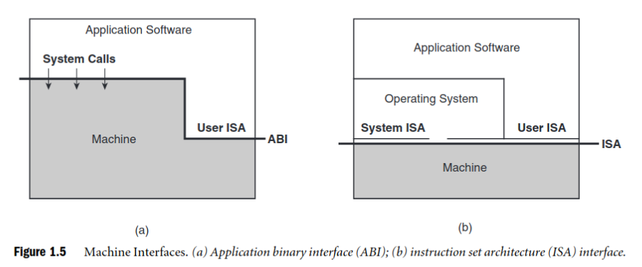

# Notes for books and lectures

## Smith and Nair 2005

### Chapter 1: Intro to VMs

Complex computer systems are managed by defining 
*levels of abstraction* separated by *well-defined interfaces*.

*Levels of abstraction* allow implementation details of lower levels to be ignored or simplified, eg. reading a file from hard disk.
They form a hierarchy. Lower levels are hardware, and higher levels are software. 

A *machine* (aka *platform*) is something that executes computer software. Usually we think of hardware, but it can also be other software.

Well-defined interfaces allow decoupling layers. Eg. (processor) instruction sets, eg. IA-32. 

#### Virtualization

Problem 1 **interoperability**: Implementations have to be tailored to specific interfaces. Eg. IA32 and PowerPC are not interoperable. OSs need to implement IA-32 and PowerPC separately. That means that if you have Windows/Linux and IA-32/PowerPC, there need to be 4 implementations. 

Problem 2 **flexibility**: Interfaces and layers have constraints. Eg. single-core vs shared-memory multicore processor have different impact on concurrency.

Virtualization means mapping an interface and resources of one system onto the interface and resources of another system.

 

Virtualization is an isomorphism from a **guest** system to a **host** system.

*Architecture* defines the functionality and apearance of a computer system, but does not include implementation details, a la a class.

*Implementation* is the embodiment of an architecture, a la an instance object.

The figure shows important interfaces and implementation layers of a computer system.

    1. your disgusting human eyes, presumably
    2. software interface between an application program and standard libs., part of the **application programming interface (API)**. An API is some sort of library that can be called to invoke various services of the system. APIs are defined wrt to high-level languages and on the osurce level.
    3. software interface: boundary of the OS, part of the **application binary interface (ABI)**. ABI provides access to hardware resources and services via a **system call** interface (included in 3) and **user instructions** (included in 7). It's a layer of indirection between the application and resources and services.
    4. ...
    5. ...
    6. ...
    7. **(User) Instruction Set Architecture (ISA)** demarkates hardware and software. **User ISA** is those aspects of the ISA that is visible to an application program. Part of both the **API** and **ABI** (ABI's user instructions).
    8. **(User & System) ISA**. **System ISA** is those aspects of the ISA that are visible to the supervisor software only, eg. to the OS. The supervisor can also see User ISA, but application cannot see System ISA.
    9. hardware memory architecture: translation of memory addresses
    10. ...
    11. I/O architecture: signals for I/O device controllers
    12. interface for memory access singls that leave the processor
    13. ...
    14. interface for the signals that the DRAM chips in memory

OS communicates with I/O devices though a sequence of interfaces: 4, 8, 10, 11, 13.    
    
From Wiki:

    ABIs cover details such as:

        - a processor instruction set (with details like register file structure, stack organization, memory access types, ...)
        - the sizes, layouts, and alignments of basic data types that the processor can directly access
        - the calling convention, which controls how functions' arguments are passed and return values are retrieved; for example, whether all parameters are passed on the stack or some are passed in registers, which registers are used for which function parameters, and whether the first function parameter passed on the stack is pushed first or last onto the stack
        - how an application should make system calls to the operating system and, if the ABI specifies direct system calls rather than procedure calls to system call stubs, the system call numbers
        - and in the case of a complete operating system ABI, the binary format of object files, program libraries and so on.

#### System VM vs Process VM

A **process VM** supports an individual process. The VM software sits at the ABI interface on top of OS/hardware. 

The VM is the **guest** and the underlying OS/hardware are the **host**. The machine emulated by the VM is called a **native machine**.

A **runtime** is the virtualizing software. It runs on top of the OS and
supports the application process.

A **system virtual machine** provides a complete system environment that can support an OS with many processes.

A **virtual machine monitor** (VMM) is what we call the virtualizing software in such machines.

#### Process VMs

They provide:
    - **replication** - an example of a process VM is the OS itself. It isolates processes: a replicated process-level VM.
    - **emulation** - emulate one instruction set on another
    - **optimization**

And also:

    - **portability/platform independence**

### Taxonomy

#### Papers

  - Popek and Goldberg 1974 (isomorphism)
  - Glenford Myers 1982 (computer architecture)

### Chapter 2: Emulation 

`source ====[ emulator ]====> target`

eg. `source instruction set =[ emulator ] => target instruction set` (aka `virtual instruction set`)

#### Interpretation 

Emulaiton can be implemented anywhere on the spectrum from **interpretation** to **binary translation**.

Interpretation: get a source instruction, multiplex, do the thing, repeat. bigger execution cost. *decode-and-dipatch* interpreter

Transation: translate a block, cache the translation, do the things. bigger translation cost.

Threaded interpretation: get a source instruction, multiplex, do the thing. except multiplexing takes place at the end of the routine that does the thing, so there's less back-and-forth. somewhere in between. used in FORTH and other 70s fossils.

Predecoding into intermediate form: parse all source into an easy-to-interpret form that contains more information, consolidates things, etc. Eg. SOOT framework for Java is single-assign. The example in the book is PowerPC and/or/add/subtract which are two opcodes, but can be parsed into one operation.

Direct threaded interpretation: replace the dispatch table with direct addresses. 

*This chapter is honestly not relevant to what I want to happen in the course.*

## Binary translation

####  Papers

- Debaere and Van Campenhout 1990 (threaded code)
- Klint 1981 (threaded interpretation)

